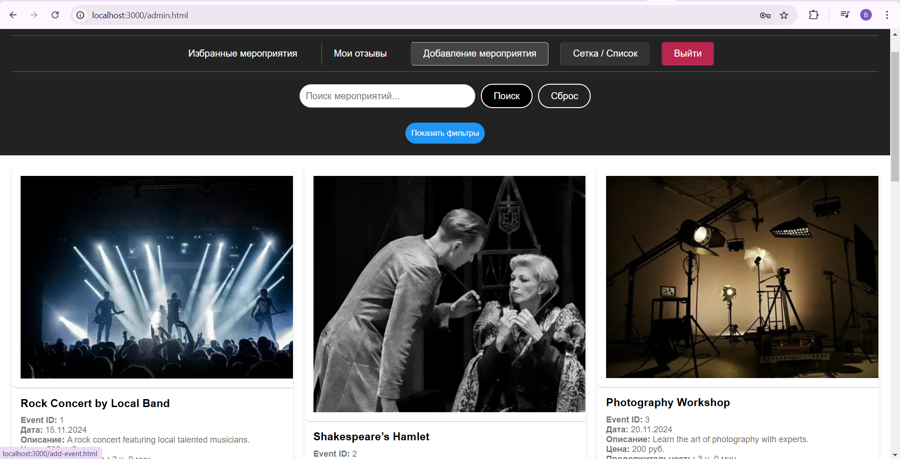
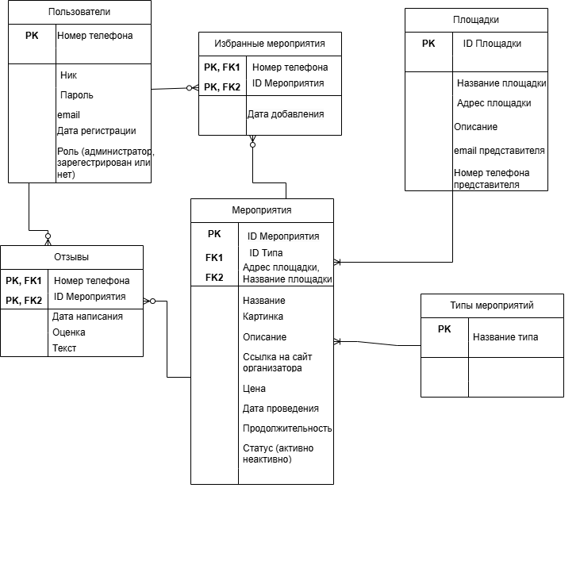

# Афиша мероприятий (Events Board)

Веб-приложение для поиска и управления городскими мероприятиями. Система предоставляет единую платформу для афиши культурных, развлекательных и спортивных событий, позволяя пользователям легко находить интересные мероприятия, а администрации — управлять контентом.


## 🚀 Основные возможности


### Для всех пользователей 
- Просмотр афиши: Полный список мероприятий без необходимости регистрации.  
- Поиск и фильтрация: Удобный поиск мероприятий по типу, дате, цене и другим параметрам.  
- Просмотр информации: Подробное описание каждого события, включая дату, место, цену, рейтинг и ссылку на организатора.

### Для зарегистрированных пользователей
- Личный кабинет: Возможность оставлять отзывы и оценки мероприятиям.  
- Избранное: Добавление понравившихся событий в персональный список для отслеживания.

### Для администраторов
- Панель управления: Полный CRUD-функционал (добавление, редактирование, удаление) для мероприятий и площадок.  
- Модерация: Контроль за добавляемым контентом и отзывами пользователей.

## 🛠️ Технологический стек  
- Backend: Node.js, Express.js  
- Frontend: HTML, CSS, JavaScript  
- База данных: PostgreSQL  
- Аутентификация: JWT (JSON Web Tokens)

## 🗃️ Структура базы данных
Проект использует реляционную базу данных со следующими основными сущностями:  
- Users (Пользователи)  
- Events (Мероприятия)  
- Venues (Площадки)  
- Reviews (Отзывы)  
- Favorites (Избранное)  
- EventTypes (Типы мероприятий)

  
*Наглядно показывает связи между сущностями.*

## 📦 Установка и запуск

- Клонируйте репозиторий:

```bash
git clone <url-этого-репозитория>
cd <папка-с-проектом>
```
Например:
```bash
git clone https://github.com/M0O0V/Zhirnov-Coursework
cd events-board
```

- Установите зависимости:
```bash
npm install
```

- Настройте базу данных:

  Создайте базу данных PostgreSQL.

  Наполните её начальными данными (миграции/сиды).

- Запустите сервер:
```bash
nodemon index.js
```

- Откройте приложение:
Перейдите по адресу http://localhost:3000 в вашем браузере.

## 📖 Документация

Полное техническое описание проекта, включая техническое задание, анализ, проектирование и руководство пользователя, доступно по ссылке:

[ЖирновСА_Курсовая_работа_тема_Афиша_Мероприятий.pdf](docs/ЖирновСА_Курсовая_работа_тема_Афиша_Мероприятий.pdf)

## 👤 Автор

**Жирнов Станислав Алексеевич** — студент группы ИУК5-51Б  
Калужский филиал МГТУ им. Н.Э. Баумана  
Руководитель: Кириллов В. Ю.  
Калуга, 2024
